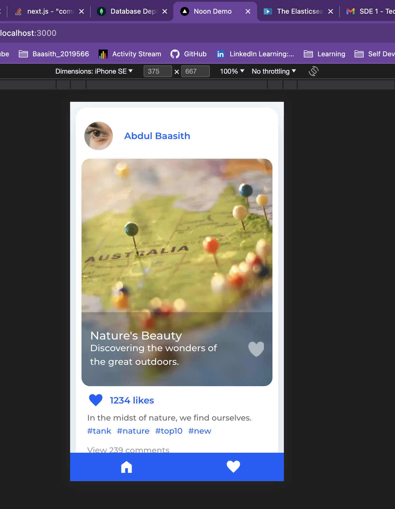

Applicartion demo can be viewd at [https://youtu.be/j_r8nXaqPzI]




Application  => ```/postman testing/api req.postman_collection.json```


Created a Simple UI like instagram clone Refering to [https://www.youtube.com/live/a6Xs2Ir40OI?feature=share]


## How to run


run following command
```bash
npm i 
npm run dev
```

Open [http://localhost:3000](http://localhost:3000) with your browser to see the result.

